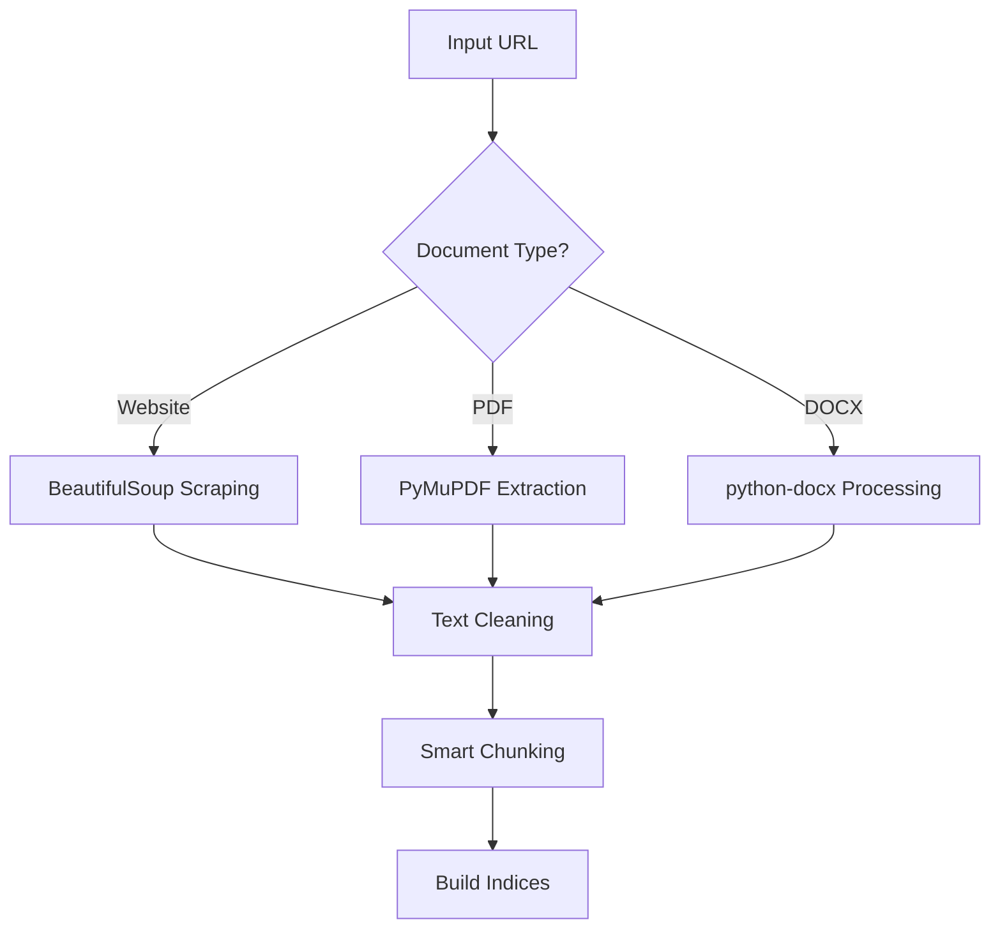
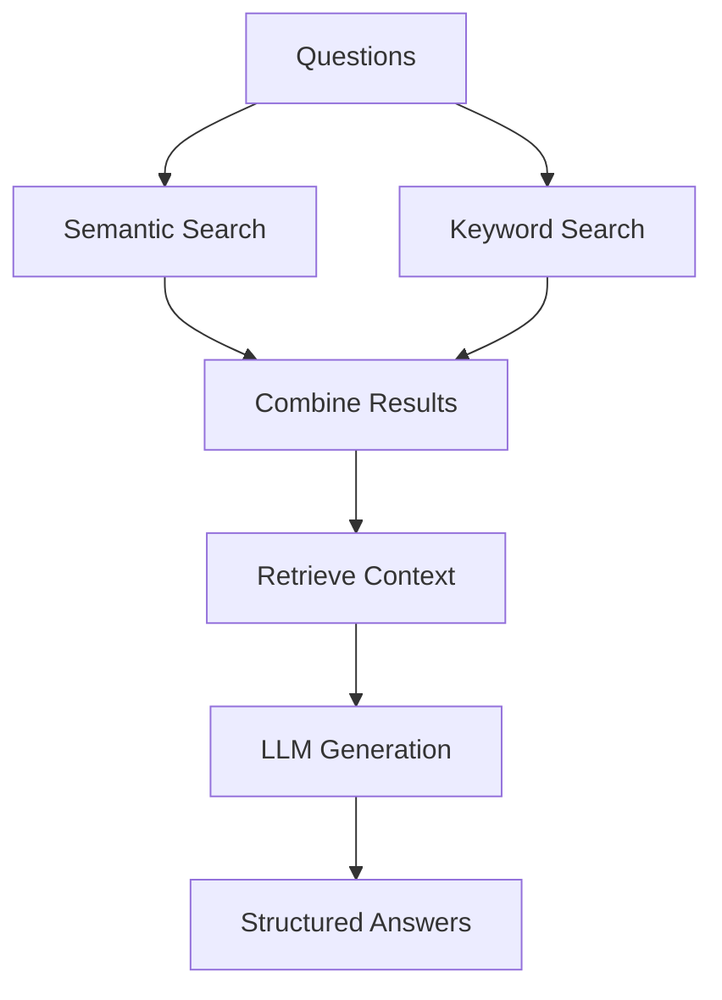

# Enhanced RAG System 🤖📚

An intelligent document processing and question-answering system that can read websites, PDFs, and Word documents to provide accurate answers using advanced retrieval-augmented generation (RAG) techniques.

## ✨ Features

- **Multi-Format Support**: Process websites, PDFs, and DOCX files
- **Intelligent Web Scraping**: BeautifulSoup + Selenium fallback for JavaScript-heavy sites
- **Hybrid Retrieval**: Combines semantic search (embeddings) with keyword matching (BM25)
- **Smart Caching**: Avoids reprocessing documents and embeddings
- **Batch Processing**: Answers multiple questions in a single optimized API call
- **Public Access**: Automatic ngrok tunnel for easy sharing
- **Production Ready**: FastAPI with proper error handling and logging

## 🚀 Quick Start

### Prerequisites

- Python 3.8+
- Chrome/Chromium browser (for Selenium)
- Internet connection

### Installation

1. **Clone and Install Dependencies**
```bash
git clone <repository-url>
cd enhanced-rag-system
pip install -r requirements.txt
```

2. **Run the System**
```bash
python app.py
```

The system will automatically:
- Install missing dependencies
- Start the FastAPI server
- Create a public ngrok tunnel
- Display the public URL

## 📋 Requirements

Create a `requirements.txt` file with:

```
fastapi==0.104.1
uvicorn==0.24.0
requests==2.31.0
beautifulsoup4==4.12.2
selenium==4.15.2
PyMuPDF==1.23.8
python-docx==1.1.0
sentence-transformers==2.2.2
faiss-cpu==1.7.4
rank-bm25==0.2.2
nltk==3.8.1
numpy==1.24.3
pyngrok==7.0.0
nest-asyncio==1.5.8
webdriver-manager==4.0.1
```

## 🔧 Configuration

Update the `Config` class in the code with your API credentials:

```python
class Config:
    NGROK_AUTHTOKEN = "your_ngrok_token_here"
    GROQ_API_KEY = "your_groq_api_key_here"
    GROQ_MODEL = "meta-llama/llama-4-scout-17b-16e-instruct"
```

### Getting API Keys

1. **Ngrok Token**: 
   - Sign up at [ngrok.com](https://ngrok.com)
   - Get your auth token from the dashboard

2. **Groq API Key**:
   - Sign up at [console.groq.com](https://console.groq.com)
   - Create an API key in your account settings

## 📚 API Usage

### Endpoint: `POST /hackrx/run`

**Request Format:**
```json
{
    "documents": "https://example.com/document.pdf",
    "questions": [
        "What is the main topic of this document?",
        "Who are the authors?",
        "What are the key findings?"
    ]
}
```

**Response Format:**
```json
{
    "answers": [
        "The main topic is artificial intelligence and machine learning applications.",
        "The authors are Dr. Smith and Dr. Johnson from MIT.",
        "Key findings include improved accuracy by 25% and reduced processing time."
    ]
}
```

### Supported Document Types

| Type | Examples | Notes |
|------|----------|--------|
| **Websites** | `https://wikipedia.org/wiki/AI` | Full HTML scraping with JS support |
| **PDFs** | `https://example.com/paper.pdf` | Text extraction from all pages |
| **DOCX** | `https://example.com/report.docx` | Paragraphs and tables |
| **Direct URLs** | Any public document link | Auto-detects file type |

## 🔍 How It Works

### 1. Document Processing


### 2. Question Answering


## 🛠️ Advanced Configuration

### Text Processing Parameters
```python
CHUNK_SIZE = 600           # Characters per chunk
CHUNK_OVERLAP = 100        # Overlap between chunks
MAX_CONTEXT_TOKENS = 6000  # Max context for LLM
DEFAULT_TOP_K = 5          # Chunks to retrieve
CONFIDENCE_THRESHOLD = 0.7 # Semantic similarity threshold
```

### Web Scraping Settings
```python
WEB_SCRAPING_TIMEOUT = 30     # Request timeout
MAX_PAGE_SIZE = 50000         # Max content size
USE_SELENIUM_FALLBACK = True  # Enable JS support
```

## 📖 Example Usage

### Python Client
```python
import requests

url = "http://your-ngrok-url.ngrok.io"
payload = {
    "documents": "https://arxiv.org/pdf/2103.00020.pdf",
    "questions": [
        "What is GPT-3?",
        "How many parameters does it have?",
        "What are its main capabilities?"
    ]
}

response = requests.post(f"{url}/hackrx/run", json=payload)
answers = response.json()["answers"]

for i, answer in enumerate(answers, 1):
    print(f"Q{i}: {payload['questions'][i-1]}")
    print(f"A{i}: {answer}\n")
```

### cURL
```bash
curl -X POST "http://your-ngrok-url.ngrok.io/hackrx/run" \
  -H "Content-Type: application/json" \
  -d '{
    "documents": "https://example.com/document.pdf",
    "questions": ["What is this document about?"]
  }'
```

## 🔧 Troubleshooting

### Common Issues

1. **Chrome/Chromium Not Found**
   ```bash
   # Ubuntu/Debian
   sudo apt-get install chromium-browser
   
   # macOS
   brew install --cask google-chrome
   ```

2. **Memory Issues with Large Documents**
   - Reduce `CHUNK_SIZE` and `MAX_CONTEXT_TOKENS`
   - Process documents in smaller batches

3. **Slow Processing**
   - Enable GPU for embeddings (requires `torch` with CUDA)
   - Increase `batch_size` in embedding generation

4. **API Rate Limits**
   - Add delays between requests
   - Use embedding cache effectively

### Performance Optimization

- **GPU Acceleration**: Install PyTorch with CUDA for faster embeddings
- **Caching**: Embeddings are automatically cached in `./embedding_cache/`
- **Batch Size**: Adjust embedding batch size based on available memory

## 🏗️ Architecture

### Core Components

| Component | Purpose | Technology |
|-----------|---------|------------|
| **WebScraper** | Extract content from websites | BeautifulSoup + Selenium |
| **DocumentLoader** | Process PDFs and DOCX files | PyMuPDF + python-docx |
| **TextProcessor** | Clean and chunk text | NLTK + Regex |
| **SmartRetriever** | Find relevant content | FAISS + BM25 |
| **AnswerGenerator** | Generate responses | Groq API |
| **EmbeddingCache** | Cache vector embeddings | File system |

### Data Flow

1. **Input**: Document URL + Questions
2. **Processing**: Extract → Clean → Chunk → Index
3. **Retrieval**: Semantic + Keyword search
4. **Generation**: Context + Question → LLM → Answer
5. **Output**: Structured JSON response


## 🆘 Support

- **Issues**: Open a GitHub issue for bugs or feature requests
- **Discussions**: Use GitHub Discussions for questions
- **Email**: [rravindranath549@gmail.com.com]

## 🙏 Acknowledgments

- [Sentence Transformers](https://www.sbert.net/) for embeddings
- [FAISS](https://faiss.ai/) for vector search
- [Groq](https://groq.com/) for fast LLM inference
- [BeautifulSoup](https://www.crummy.com/software/BeautifulSoup/) for web scraping
